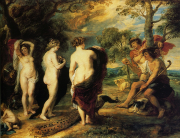

The MultimEdia Entity Representation and Question Answering Tasks (**MEERQAT**) project was a collaborative project (2020-2024) [funded by the French National Research Agency (ANR)](https://anr.fr/Project-ANR-19-CE23-0028). This page is a static saving of the website of the project (was www.meerqat.fr)

# Overview
Exploiting multimedia content often relies on the correct identification of entities in text and images. A major difficulty for understanding a multimedia content lies in its ambiguity with regard to the actual user needs, for instance when identifying an entity from a given textual mention or matching a visual perception to a need expressed through language.

The project proposes to tackle the problem of **analyzing ambiguous visual and textual content** by learning and combining their representations and by **taking into account the existing knowledge about entities**. We aim at not only disambiguating one modality by using the other appropriately but also to jointly disambiguate both by representing them in a common space. The full set of contributions proposed in the project will then be used to solve a new task that we define, namely Multimedia Question Answering (MQA)1. This task requires to rely on three different sources of information to answer a textual question with regard to visual data as well as a knowledge base (KB) containing millions of unique entities and associated texts.

.

Considering the image above, to answer the question "Who is Paris looking at ?", one needs to understand the question and disambiguate the term *Paris*, as relating to Greek mythology. For this, the painting of Rubens helps but does not give the answer directly because even a fine visual analysis does not provide a direct answer. However, using a knowledge base and accessing the entity related to the Greek hero or the painting can help to answer Aphrodite.

In a simpler form, the MQA task is actually commonly practiced in the everyday life, through a decomposed process.
* while watching a film or a TV-series, one can wonder "In which movie did I already see this actress?". The answer usually requires to first determine the actress name from the credits of the film, then to access to a knowledge base such as IMDB or Wikipedia to obtain the list of the previous films the actress played. In an even simpler form, such a scenario matches to industrial needs.
* in the context of maintenance or technical support, one may have to determine the reference of a particular product to access the available information required to ensure a technical operation. It is then easy to get the reference from a simple picture (other means are not always available); then the access to the required need can be posed as a QA problem.

While usually feasible, the weakness of the current approaches to these use cases is that they often rely on “disconnected” technologies. Beyond the theoretical motivation to provide a more unified approach, the project is **fundamentally interested into better understanding the links that exist between language, vision and knowledge**.

# Main results
At the beginning of the project, a quite similar task has been proposed by (Shah et al., 2019) and named Knowledge-Aware Visual Question Answering (KVQA). It nevertheless focused on the knowledge concerning the persons only. During the first year of the project, we thus renamed the task Knowledge-based Visual Question Answering about named Entities (KVQAE) and proposed the ViQuAE benchmark and baseline model to address it, with more than 900 different types of entities [(code)](https://github.com/PaulLerner/ViQuAE).

(...)

# Publications
* **Entity-Aware Cross-Modal Pretraining for Knowledge-based Visual Question Answering** 
*Omar Adjali, Paul Grimal, Olivier Ferret, Sahar Ghannay, Hervé Le Borgne* 
ECIR 2025
* **Multi-Level Information Retrieval Augmented Generation for Knowledge-based Visual Question Answering** 
*Omar Adjali, Paul Grimal, Olivier Ferret, Sahar Ghannay, Hervé Le Borgne* 
EMNLP 2024 
* **Is ImageNet worth 1 video? Learning strong image encoders from 1 long unlabelled video** 
*Shashanka Venkataramanan, Mamshad Nayeem Rizve, João Carreira, Yuki M. Asano, Yannis Avrithis* 
ICLR 2024 (oral, top 1.2%)   Outstanding Paper Awards (Honorable mention)
* **Probing Pretrained Language Models with Hierarchy Properties** 
*Jesus Lovon-Melgarejo, Jose Moreno, Romaric Besançon, Olivier Ferret, Lynda Tamine* 
ECIR 2024    also presented at TALN 2024
* **Cross-modal Retrieval for Knowledge-based Visual Question Answering** 
*Paul Lerner, Olivier Ferret, Camille Guinaudeau* 
ECIR 2024  
* **Embedding Space Interpolation Beyond Mini-Batch, Beyond Pairs and Beyond Examples** 
*Shashanka Venkataramanan, Ewa Kijak, Laurent Amsaleg, Yannis Avrithis* 
NeurIPS 2023  
* **Explicit Knowledge Injection for Knowledge-Aware Visual Question Answering** 
*Omar Adjali, Paul Grimal, Olivier Ferret, Sahar Ghannay, Hervé Le Borgne* 
ICMR 2023 
* **MEERQAT-IRIT at SemEval-2023 Task 2: Leveraging Contextualized Tag Descriptors for Multilingual Named Entity Recognition** 
*Jesús Lovón-Melgarejo, José G Moreno, Romaric Besançon, Olivier Ferret, Lynda Lechani* 
SemEval-2023 
* **Multimodal Inverse Cloze Task for Knowledge-based Visual Question Answering** 
*Paul Lerner, Olivier Ferret, and Camille Guinaudeau* 
ECIR 2023   also presented at TALN 2023
* **Can We Guide a Multi-Hop Reasoning Language Model to Incrementally Learn at each Single-Hop?** 
*Jesus Lovon, Jose G. Moreno, Romaric Besançon, Olivier Ferret and Lynda Tamine Lechani* 
COLING 2022  
* **ViQuAE, a Dataset for Knowledge-based Visual Question Answering about Named Entities** 
*Paul Lerner, Olivier Ferret, Camille Guinaudeau, Hervé Le Borgne, Romaric Besançon, José G. Moreno, Jesús Lovón Melgarejo* 
SIGIR 2022  
* **AlignMixup: Improving representations by interpolating aligned features** 
*Shashanka Venkataramanan, Yannis Avrithis, Ewa Kijak, Laurent Amsaleg* 
CVPR 2022  
* **It Takes Two to Tango: Mixup for Deep Metric Learning** 
*Shashanka Venkataramanan, Bill Psomas, Ewa Kijak, Laurent Amsaleg, Konstantinos Karantzalos, Yannis Avrithis* 
ICLR 2022  

### In French
* **Un jeu de données pour répondre à des questions visuelles à propos d’entités nommées** 
*Paul Lerner, Salem Messoud, Olivier Ferret, Camille Guinaudeau, Hervé Le Borgne, Romaric Besançon, Jose Moreno and Jesús Lovón-Melgarejo* 
Traitement Automatique des Langues 2023 – numéro spécial dédié au TAL inter-/multimodal (numéro 63-2)
* **Reconnaissance d’Entités Nommées fondée sur des Modèles de Langue Enrichis avec des Définitions de Types d’Entités** 
*Jesus Lovon-Melgarejo, Jose Moreno, Romaric Besançon, Olivier Ferret, Lynda Tamine* 
TALN 2023 
* **Recherche cross-modale pour répondre à des questions visuelles** 
*Paul Lerner, Olivier Ferret, Camille Guinaudeau* 
CORIA-TALN 2023 
* **Un jeu de données pour répondre à des questions visuelles à propos d’entités nommées en utilisant des bases de connaissances** 
*Paul Lerner, Olivier Ferret, Camille Guinaudeau, Hervé Le Borgne, Romaric Besançon, Jose Moreno and Jesús Lovón-Melgarejo* 
TALN 2022  

# Partners
The project was conducted by four partners:
* the **CEA List** institute achieves technology transfer in the field of smart digital systems. The team involved works both in computer vision and computational linguistics, relying on machine learning. In particular, it works on Entity Linking and cross-modal retrieval using textual-visual joint spaces . It has a strong experience in evaluation campaign organization (e.g Retrieving Diverse Social Images task at Media-Eval from 2013 to 2017) and participation.  <u>Persons</u>: Omar Adjali, Romaric Besançon, Olivier Ferret and Hervé Le Borgne.
* the **INRIA** participates with the team LinkMedia, focusing on content-based media linking and aiming to create explicit links at different levels to reflect context: at signal level, e.g. repeating patterns, or at a semantic level, e.g. to follow topics or stories. The team has in particular a strong experience in computer vision. It has pioneered research in large-scale visual retrieval and nearest neighbor search and holds state of the art with conventional features and more recent deep visual representations, including manifold learning.  <u>Persons</u>: Laurent Amsaleg, Yannis Avrithis and Ewa Kijak, Shashank Venkataramanan
* **IRIT** represents one of the most important potential in computer science research in Southern France. The 24 research teams of the laboratory are structured into seven scientific topics that cover all the fields of computing sciences. Jose Moreno and Yoann Pitarch are associate professors and Lynda Tamine is a full professor, all them members of the IRIS team. Their more related work to the project focuses on textual-graph representation and entity embedding, and their applications.  <u>Persons</u>: Jesús Lovón, Jose Moreno and Lynda Tamine
* **LISN** was created on january 2021, integrating the LRI and LIMSI. This last has a strong expertise in natural language processing. Anne Vilnat, professor, Sahar Ghannay, assistant professor, and Anne-Laure Ligozat, associate professor, are members of the ILES group and work on entity linking, representation learning, information extraction and question answering from textual data. Camille Guinaudeau, associate professor from the TLP group, is interested in person identification in multimedia documents and information retrieval in multimodal data.  <u>Persons</u>: Sahar Ghannay, Camille Guinaudeau, Paul Lerner and Anne Vilnat
# Contact
For any question, let write to [Hervé Le Borgne](https://hleborgne.github.io/) who was the project coordinator.

